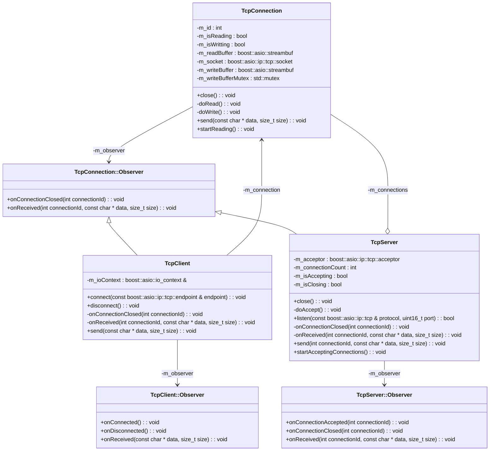

# [](https://github.com/alejandrofsevilla/boost-tcp-server-client/actions/workflows/LinuxBuild.yml?event=push) [](https://github.com/alejandrofsevilla/boost-tcp-server-client/actions/workflows/LinuxBuildAndTest.yml?event=push)
# Boost TCP Server/Client
Asynchronous [Boost.Asio](https://www.boost.org/doc/libs/1_74_0/doc/html/boost_asio.html) TCP server and client example. 
## Requirements
- C++17 compiler
- CMake 3.22.0
- Boost 1.74.0
- GoogleTest 1.11.0

## Usage
### Server
```cpp
struct : TcpServer::Observer {
  void onConnectionAccepted(int id) {
    std::cout << "New client connected with id " << id << std::endl;
  };
  void onConnectionClosed(int id) {
    std::cout << "Client " << id << " disconnected" << std::endl;
  };
  void onReceived(int id, const char* data, size_t size) {
    std::cout << "Data received from client " << id << ": ";
    std::cout.write(data, size);
    std::cout << std::endl;
  }
} observer;

boost::asio::io_context context;
std::thread thread{[&context]() { context.run(); }};

TcpServer server{context, observer};
server.listen(boost::asio::ip::tcp::v4(), 1234);
server.startAcceptingConnections();

```
### Client 
```cpp
struct : TcpClient::Observer {
  void onConnected() { std::cout << "Client connected" << std::endl; };
  void onDisconnected() { std::cout << "Client disconnected" << std::endl; };
  void onReceived(const char* data, size_t size) {
    std::cout << "Data received from server: ";
    std::cout.write(data, size);
    std::cout << std::endl;
  }
} observer;

boost::asio::io_context context;
std::thread thread{[&context]() { context.run(); }};

TcpClient client{context, observer};
client.connect({boost::asio::ip::address::from_string("127.0.0.1"), 1234});
```
## Build and test
- Install dependencies.
   ```terminal
   sudo apt-get install libboost-dev
   sudo apt-get install libgtest-dev
   ```
- Clone repository.
   ```terminal
   git clone https://github.com/alejandrofsevilla/boost-tcp-server-client.git
   cd boost-tcp-server-client
   ```
- Build.
   ```terminal
   cmake -S . -B build
   cmake --build build
   ```
- Run tests.
   ```terminal
   ./build/tests/boost-tcp-server-client-tests 
   ```
### Include in CMake project
   ```cmake
   include(FetchContent)
   Fetchcontent_Declare(boost-tcp-server-client
     GIT_REPOSITORY http://github.com/alejandrofsevilla/boost-tcp-server-client.git
     GIT_TAG "main")
   FetchContent_Makeavailable(boost-tcp-server-client)

   target_link_libraries(${PROJECT_NAME} PRIVATE boost-tcp-server-client)
   ```
## Design


